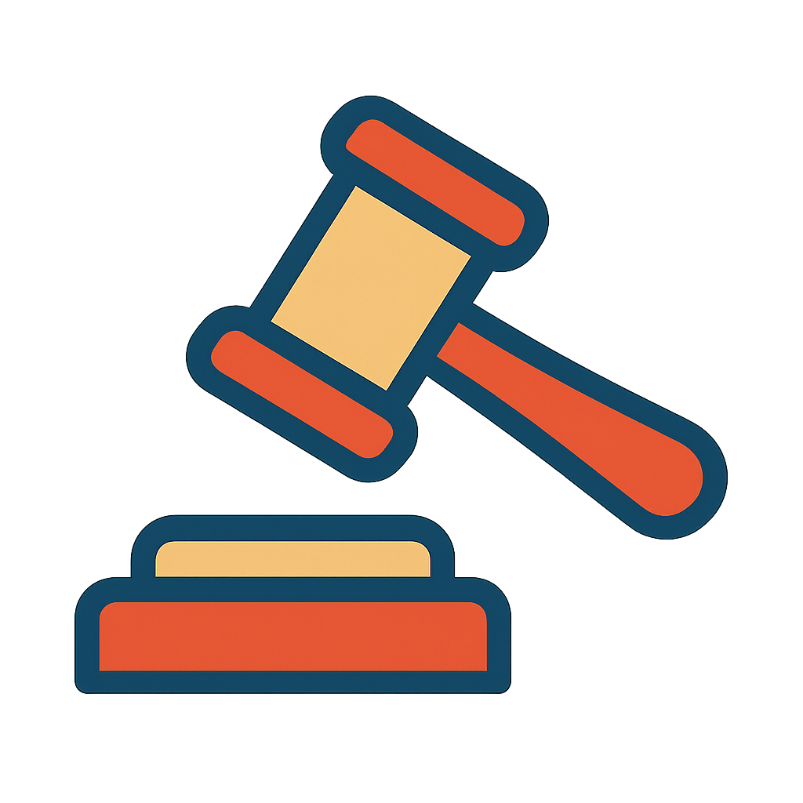

<a id="readme-top"></a>

<br />
<div align="center">
  <a href="https://github.com/jmsaRuc/D_RAG">
    
  </a>

  <h3 align="center">Danish Retrieval Augmented Generations</h3>
  
[![Contributors][contributors-shield]][contributors-url]
[![Forks][forks-shield]][forks-url]
[![Stargazers][stars-shield]][stars-url]
[![Apache-2.0 license][license-shield]][license-url]
[![LinkedIn][linkedin-shield]][linkedin-url]

---
  <p align="center">
    An example of Danish Retrieval Augmented Generation using open-source tools and models: 
    A Danish legal Assistant, using 146.237 thousand Danish legal documents as context. Made as part of a university project: 
    "Optimizing the Viability of Local Open Source LLMs For Danish Use Cases"
    <br/>
  </p>
</div>

<details>
  <summary>Table of Contents</summary>
  <ol>
    <li>
      <a href="#about-the-project">About The Project :newspaper:</a>
    </li>
    <li>
      <a href="#pre-requisites">Pre-requisites :white_check_mark:</a>
    </li>
    <li>
      <a href="#-quickstart">Quickstart :rocket:</a>
    </li>
    <li>
      <a href="#how-drag-works">How D_RAG Works :microscope:</a>
    </li>
    <li>
      <a href="#outputs">Outputs :speech_balloon:</a>
    </li>
    <li>
      <a href="#acknowledgments">Acknowledgments :clap:</a>
    </li>
  </ol>
</details>

## About The Project :newspaper:

[![Product Name Screen Shot][product-screenshot]](https://smith.langchain.com/studio/?baseUrl=http://127.0.0.1:2024)


D_RAG is a spirituel fork of the LangChain repository [local-deep-researcher](https://github.com/langchain-ai/local-deep-researcher). It is a Danish law chat-bot, with a fully deployable API-stack built in Python.
It takes danish questions about danish law, and answers them in Danish, using 146.237 thousand Danish legal documents, avalible on [retsinformation.dk](https://retsinformation.dk/), as posible retrived context. It awnser in Danish, can be run in a local environment, using either Ollama or Groq as the OpenAI models. 

*This project was made as part of a university asignment on Optimizing the Viability of Local Open Source LLMs For Danish Use Cases*

<p align="right">(<a href="#readme-top">back to top</a>)</p>

## Pre-requisites :white_check_mark: 

pre-requisites:
- Python 3.11 or later
- Poetry, see [Poetry installation guide](https://python-poetry.org/docs/#installation) 
- for localy running models, install [Ollama](https://ollama.com/download)
- for hosted models, either get a grop API key from [Groq](https://groq.com/) or a openai API key from [OpenAI](https://platform.openai.com/signup)

## Quickstart :rocket:

Clone the repository:
```shell
git clone https://github.com/jmsaRuc/D_RAG
cd D_RAG
```


Then edit the `.env` file to customize the environment variables according to your needs. These environment variables control the model selection, and other configuration settings, shuch as Api and research depth. 
When you run the application, these values will be automatically loaded via `python-dotenv` (because `langgraph.json` points to the "env" file).
```shell
cp .env.example .env
```

<p align="right">(<a href="#readme-top">back to top</a>)</p>

### Selecting model :performing_arts:

Choose from either locally or remotely hosted.

#### Selecting local model with Ollama

1. Download the Ollama app for Mac [here](https://ollama.com/download).

2. Pull a local LLM from [Ollama](https://ollama.com/search). As an [example](https://ollama.com/library/deepseek-r1:8b):
```shell
ollama pull deepseek-r1:1.5b-qwen-distill-q8_0
```

3. Optionally, update the `.env` file with the following Ollama configuration settings. 

* If set, these values will take precedence over the defaults set in the `Configuration` class in `configuration.py`. 
```shell
LLM_PROVIDER=ollama
OPENAI_API_BASE="http://localhost:11434/" # Ollama service endpoint, defaults to `http://localhost:11434/` 
LOCAL_LLM=deepseek-r1:1.5b-qwen-distill-q8_0 # the model to use, defaults to `deepseek-r1:1.5b-qwen-distill-q8_0` if not set
```

#### Selecting hosted model with Groq or OpenAI
1. Get an API key from [Groq](https://groq.com/) or [OpenAI](https://platform.openai.com/signup).
2. Update the `.env` file with the following configuration settings. If set, these values will take precedence over the defaults set in the `Configuration` class in `configuration.py`. 

#### Groq Configuration
```shell
LLM_PROVIDER=groq 
GROQ_API_KEY=xxx # the Groq API key to use
GROQ_API_BASE=https://api.groq.com/ # the Groq API base URL, defaults to `https://api.groq.com/`
GROQ_LLM=deepseek-r1-distill-llama-70b # the Groq model to use, defaults to `deepseek-r1-distill-llama-70b`
```
#### OpenAI Configuration
```shell
LLM_PROVIDER=openai
OPENAI_API_KEY=xxx # the OpenAI API key to use
OPENAI_API_BASE=https://api.openai.com/v1/ # the OpenAI API base URL, defaults to `https://api.openai.com/v1/`
OPENAI_MODEL=o3-mini # the OpenAI model to use, defaults to `o3-mini`
```
<p align="right">(<a href="#readme-top">back to top</a>)</p>

### Running the Server :satellite:
To run the Local Deep Researcher application, you can need [Poetry](https://python-poetry.org/) 
installed. Poetry is a dependency management tool for Python that simplifies the process of managing project dependencies and virtual environments.

Follow these steps:
1. Install the required dependencies using Poetry:

```shell
poetry install
```

2. Run the application using Poetry:

```shell
poetry run langgraph dev --allow-blocking --host 0.0.0.0
```

<p align="right">(<a href="#readme-top">back to top</a>)</p>

### Running D_RAG with Docker :whale:

To run D_RAG in a Docker container, you can use the provided Docker Compose file. This allows you to encapsulate the environment and dependencies, making it easier to deploy and run the application consistently across different systems.

1. Ensure you have Docker and Docker Compose installed on your machine.
2. Create a `.env` file in the root directory of the project, based on the `.env.example` file, and fill in your API keys and other configurations as needed.
3. Run the following command to build and start the Docker container:
```bash
docker compose --env-file .env up --build
```
4. Once the container is running, you can access the application via the URL provided in the terminal output, typically `http://localhost:2024`.
5. You can also access the LangGraph Studio UI at `https://smith.langchain.com/studio/?baseUrl=http://localhost:2024`.

NOTE: You will see log message:
```
2025-02-10T13:45:04.784915Z [info     ] 🎨 Opening Studio in your browser... [browser_opener] api_variant=local_dev message=🎨 Opening Studio in your browser...
URL: https://smith.langchain.com/studio/?baseUrl=http://0.0.0.0:2024
```
...but the browser will not launch from the container.

Instead, visit this link with the correct baseUrl IP address: [`https://smith.langchain.com/studio/thread?baseUrl=http://127.0.0.la1:2024`](https://smith.langchain.com/studio/thread?baseUrl=http://127.0.0.1:2024)


<p align="right">(<a href="#readme-top">back to top</a>)</p>

### Using the LangGraph Studio UI :pager:

When you launch LangGraph server, you should see the following output and Studio will open in your browser:
> Ready!

> API: http://127.0.0.1:2024

> Docs: http://127.0.0.1:2024/docs

> LangGraph Studio Web UI: https://smith.langchain.com/studio/?baseUrl=http://127.0.0.1:2024

Open `LangGraph Studio Web UI` via the URL above. In the `configuration` tab, you can directly set various assistant configurations. Keep in mind that the priority order for configuration values is:

```
1. Environment variables (highest priority)
2. LangGraph UI configuration
3. Default values in the Configuration class (lowest priority)
```

<p align="right">(<a href="#readme-top">back to top</a>)</p>

## How D_RAG Works :microscope:

D_RAG is an integrated solution that builds on two powerful approaches: Adamic RAG (A-RAG) and Confined Deep Research (CDR). The application is designed as a fully deployable API-stack written in Python, providing a Danish law chat-bot that leverages multiple language model sources to answer queries related to Danish law. 

### Overview of the Nodes 
The D_RAG graph consists of several nodes that work together to process user queries, perform searh and crawls of retsinformation, and generate answers. The nodes are designed to handle the entire workflow from question translation to final answer generation. Here’s a breakdown of the main nodes and their functions:

1. **Translate Question:**  
    - The system translates the user's Danish question into English using the selected LLM.  

2. **Generate Research Topic:**  
    - With the translated question, the system generates multiple follow-up questions.  
    - These questions form the research topic, shaping the subsequent search and analysis.

3. **Generate Query:**  
    - A Danish search query is produced based on the research topic.  
    - It employs both a reversed translation example (A-RAG) and the original Danish semantic context (TAG) to ensure robust query formation.

4. **Web Research:**  
    - The generated Danish query is used in a search crawl pipeline to retrieve relevant sources.  
    - The crawling logic is principally managed in the retsinfo_crawl.py module.

5. **Translate Search Results:**  
    - Retrieved Danish sources are asynchronously translated to English through chat-completion requests to the chosen LLM API.  
    - The translation logic is implemented in translate_async.py.

6. **Summarize Sources:**  
    - For the first iteration, an English summary of the retrieved sources is created using the initial research topic.  
    - In subsequent iterations, the summary is extended with new findings, maintaining continuity of the context.

7. **Reflect on Summary:**  
    - The complete English summary is analyzed to pinpoint knowledge gaps relative to the research topic.  
    - A follow-up query in English is generated to address these gaps.  
    - If the number of research cycles is below the user-defined maximum (default: 3), it proceeds to a content translation follow-up; otherwise, it advances to generate the final answer.

8. **Translate Content Follow Up:**  
    - The follow-up query is translated back into Danish using an A-TAG methodology.  
    - This step leverages a previously translated Danish source alongside its English version for context.

9. **Generates Final Answer:**  
    - The final iteration of the English summary, combined with the user's original question (translated to English), is used to produce a comprehensive final answer in English.

10. **Translate Answer:**  
    - The final English answer is translated back into Danish using the same method as the Translate Content Follow Up step.

11. **Finalized Answer:**  
    - The system appends all source titles and URLs to the final translated answer.  
    - A title is added to the answer along with a subtitle to the source list, providing a structured end result.


<p align="right">(<a href="#readme-top">back to top</a>)</p>

## Outputs :speech_balloon:

The output of the graph is a markdown file containing the research summary, with citations to the sources used. All sources gathered during research are saved to the graph state. You can visualize them in the graph state, which is visible in LangGraph Studio:

(indest her billede)

The final summary is saved to the graph state as well:

(indset her billede)


<p align="right">(<a href="#readme-top">back to top</a>)</p>

## Contributors: :wrench:

<a href="https://github.com/jmsaRuc/D_RAG/graphs/contributors">
  
</a>


## Acknowledgments :clap:

* [local-deep-researcher](https://github.com/langchain-ai/local-deep-researcher)
* [Crawl4Ai](https://github.com/unclecode/crawl4ai)


<a href="https://github.com/unclecode/crawl4ai">
  
</a>

<p align="right">(<a href="#readme-top">back to top</a>)</p>

<!-- MARKDOWN LINKS & IMAGES -->
<!-- https://www.markdownguide.org/basic-syntax/#reference-style-links -->
[contributors-shield]: https://img.shields.io/github/contributors/jmsaRuc/D_RAG.svg?style=for-the-badge
[contributors-url]: https://github.com/jmsaRuc/D_RAG/graphs/contributors
[forks-shield]: https://img.shields.io/github/forks/jmsaRuc/D_RAG.svg?style=for-the-badge
[forks-url]: https://github.com/jmsaRuc/D_RAG/network/members
[stars-shield]: https://img.shields.io/github/stars/jmsaRuc/D_RAG.svg?style=for-the-badge
[stars-url]: https://github.com/jmsaRuc/D_RAG/stargazers
[license-shield]: https://img.shields.io/github/license/jmsaRuc/D_RAG.svg?style=for-the-badge
[license-url]: https://github.com/jmsaRuc/D_RAG/blob/master/LICENSE.txt
[linkedin-shield]: https://img.shields.io/badge/-LinkedIn-black.svg?style=for-the-badge&logo=linkedin&colorB=555
[linkedin-url]: www.linkedin.com/in/jens-mikkel-andersen-0b0b57256
[product-screenshot]: docs/exemple_afsvar.png


